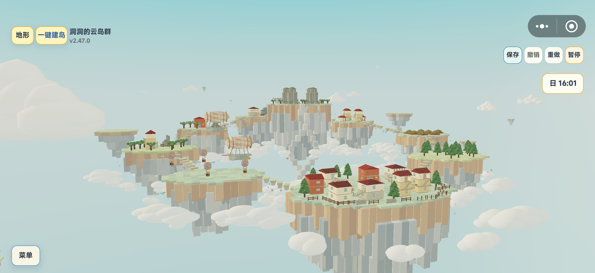
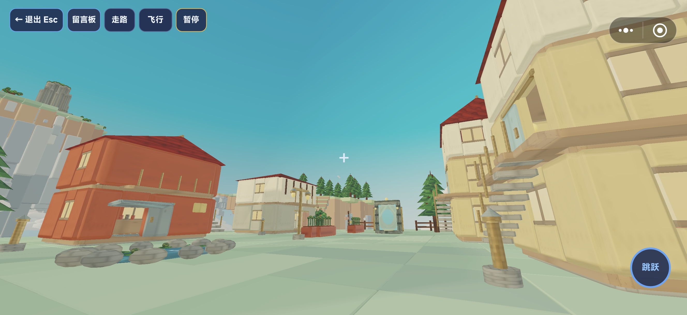
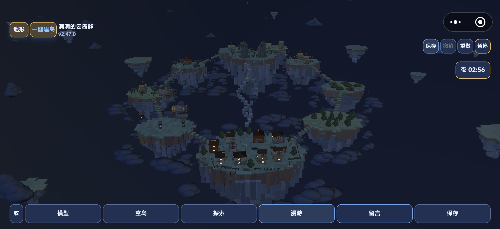

# Maker 3D

这个仓库集中保存两套可以独立使用的 3D 创作项目。

> **随便改，随便造。** 本仓库采用 [CC0 1.0 Universal](./LICENSE)：可以自由复制、修改、组合、再发布和商用，无需申请授权，也不强制署名。

| 目录 | 项目 | 说明 |
| --- | --- | --- |
| [`threejs-workbench/`](./threejs-workbench/) | Three.js 模型工作台 | 浏览器版积木模型编辑器，支持多形状、多材质、精确变换、模型库以及 JSON 导入导出。 |
| [`floating-island-maker/`](./floating-island-maker/) | 我的空岛 | TapTap Maker 完整项目，包含空岛建设、模型工作台、模型市场、探索与第一人称漫游。 |

## Three.js 工作台预览


## 我的空岛预览



| 第一人称漫游 | 夜间空岛 |
| --- | --- |
|  |  |

## 快速开始

### Three.js 模型工作台

```bash
cd threejs-workbench
python3 -m http.server 8080
```

然后访问 <http://127.0.0.1:8080/>。不要直接双击 `index.html`，因为浏览器会限制模型库 JSON 的本地文件读取。

### 我的空岛

`floating-island-maker/` 保留了完整 Maker 工程结构。使用 TapTap Maker 打开该目录即可继续开发；项目的模块说明、操作方式和验证信息见其 [`README.md`](./floating-island-maker/README.md)。

## 两个项目之间的数据关系

- Three.js 工作台使用与“我的空岛”一致的模型 JSON v3 数据结构，可以互相导入、导出。
- 浏览器工作台的内置模型库来自 `floating-island-maker/scripts/BuiltinTemplates.lua`。
- 更新 Maker 内置模型后，可在 `threejs-workbench/` 中重新生成浏览器模型库：

```bash
lua generate-model-library.lua ../floating-island-maker model-library.json
```

## 支持作者

项目免费开放，使用不设限制。如果它恰好帮到了你，也欢迎请作者喝杯咖啡，支持后续维护和创作。完全自愿，感谢喜欢。

<p align="center">
  
</p>

## 开放协议

本仓库采用 **CC0 1.0 Universal**。在法律允许的最大范围内，项目作者放弃对本仓库原创代码、模型、纹理、界面与数据的版权和相关权利。

你可以：

- 随便修改，做成自己的工作台或游戏；
- 随便组合、拆分和制作新模型；
- 用于个人项目或商业项目；
- 复制、再发布或作为其他项目的基础；
- 不署名，也不必事先联系我们。

一句话：**拿去用，随便改，随便造。** 仓库未直接包含的第三方依赖仍遵循其各自协议。
