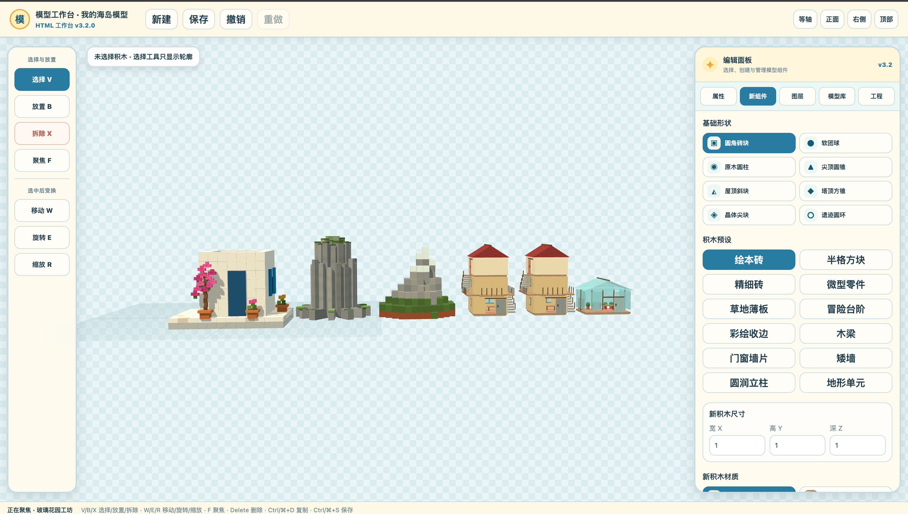

# Three.js 模型工作台

这是“我的空岛”模型工作台的浏览器版实现，当前界面版本为 `v3.2.0`。



## 功能

- 8 种形状：圆角方块、球体、圆柱、圆锥、三棱柱、四棱锥、四面体和圆环。
- 27 种材质、24 个主题色以及完整内置模型库。
- 选择、放置、移动、旋转、缩放、复制、删除、撤销与重做。
- 包围盒、吸附辅助线、颜色吸管、图层以及相机视角控制。
- 与“我的空岛”兼容的 JSON v3 导入与导出。

## 启动

项目使用 ES Module，并通过请求加载 `model-library.json`，因此需要静态文件服务器：

```bash
python3 -m http.server 8080
```

浏览器打开 <http://127.0.0.1:8080/>。

Three.js `0.180.0` 当前从 jsDelivr 加载，第一次打开时需要能够访问该 CDN。

## 更新内置模型库

仓库同时保留了完整 Maker 项目。修改 `../floating-island-maker/scripts/BuiltinTemplates.lua` 后，在本目录运行：

```bash
lua generate-model-library.lua ../floating-island-maker model-library.json
```

生成器会调用 Maker 项目的 `BuiltinTemplates.BuildAll()`，因此浏览器版使用的是同一份模型数据，而不是单独维护的近似副本。
